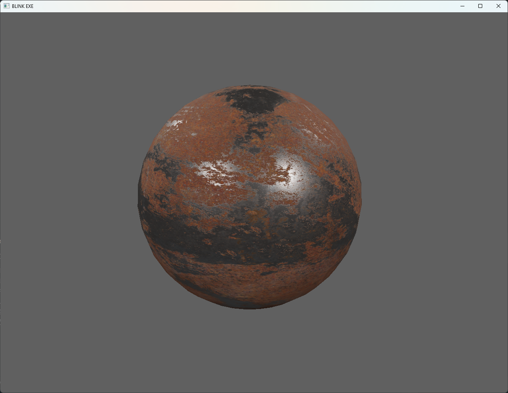

# blinkexe

A learning purpose, *WIP* Renderer Based on OpenGL. The name "BLINK.EXE" is from one of my favorite adventure/puzzle game **[Quadrilateral Cowboy](https://store.steampowered.com/app/240440/Quadrilateral_Cowboy/)**.

## Features

* Obj model assets loading.
* PBR.
* ECS architecture.

## Gallery

## TODOs

* IBL.

## Credits

* HDR maps from [HDRI-Haven](https://hdri-haven.com/).
* Learn OpenGL basics from [LearnOpenGL CN](https://learnopengl-cn.github.io/)(Chinese).
* Implementation highly inspired by [GetIntoGameDev OpenGL Series](https://www.youtube.com/playlist?list=PLn3eTxaOtL2PHxN8EHf-ktAcN-sGETKfw)